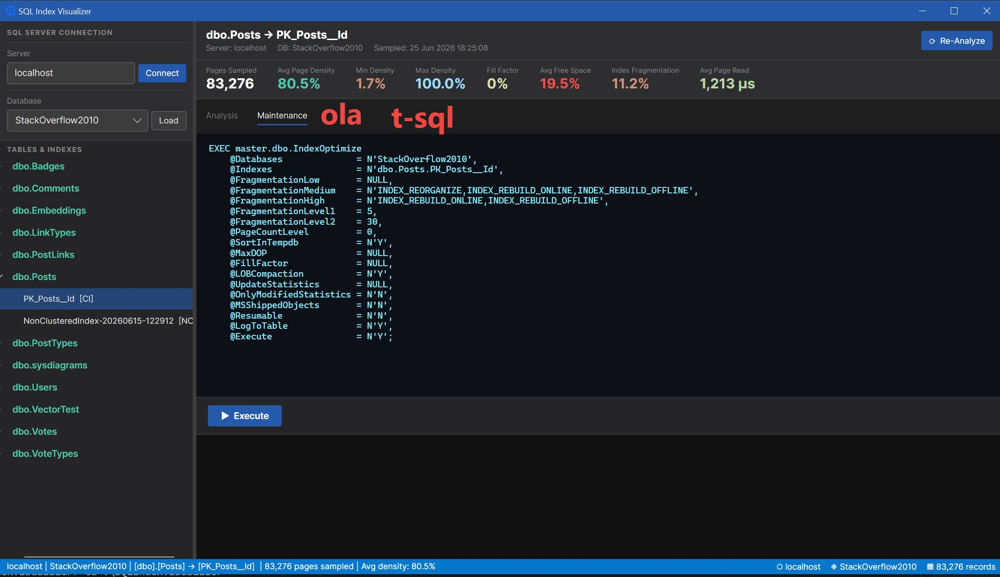

# SQL Index Visualizer

A dark-mode Windows desktop app for visualising SQL Server index page density — built on [Avalonia](https://avaloniaui.net/) and [ScottPlot](https://scottplot.net/).

## What it does

Connect to any SQL Server, pick a database, and right-click any index to run an analysis. The app samples every Nth page of the index and plots **page density** (how full each 8 KB page is) against **logical page order**, along with the average page read time in microseconds. The result is a visual signature of that index's physical state.



### Why this matters

Common wisdom says random GUIDs as primary keys cause catastrophic fragmentation. This tool lets you actually see what happens:

- **Random GUIDs** insert uniformly across the whole index, keeping pages consistently dense. Traditional fragmentation metrics mislead you.
- **Sequential GUIDs (`NEWSEQUENTIALID`)** are probably not the answer you're looking for.
- **Reorganize** generates orders-of-magnitude more transaction log usage than Rebuild — and you can watch the density chart before and after to compare.

The scatter plot shows the real shape of your index. The rolling average line reveals trends. The fill-factor reference line tells you whether maintenance is even needed.

## Prerequisites

| Requirement | Notes |
| --- | --- |
| .NET 10 SDK | [Download](https://dotnet.microsoft.com/download/dotnet/10.0) |
| Windows | WinExe target; Avalonia Desktop |
| SQL Server 2008+ | Windows auth (Trusted Connection) |
| `sysadmin` or `CONTROL SERVER` | Required to run `DBCC PAGE` internally |

## Build & run

```powershell
git clone https://github.com/ronaldgithub/SQLIndexVisualizer.git
cd SQLIndexVisualizer
dotnet run --project SQLIndexVisualizer/SQLIndexVisualizer.csproj
```

Or open `SQLIndexVisualizer.slnx` in Visual Studio 2022 (17.12+) or Rider and hit Run.

## Usage

1. **Connect** — enter your server name (default: `localhost`) and click **Connect**.
2. **Load** — select a database from the dropdown and click **Load** to populate the index tree.
3. **Analyse** — right-click any index and choose **Analyze Index**. The app samples the index pages and plots density. Large indexes can take several minutes.
4. **Maintain** — click **Reorganize**, **Rebuild**, or **Rebuild Online** to open a confirmation dialog where you can review or change the fill factor before executing. After maintenance the index is re-analyzed automatically so you can compare before/after density.

## Chart legend

| Series | Colour | Meaning |
| --- | --- | --- |
| Scatter points | Blue | Raw page density per sampled page |
| Rolling average | Red | Sliding-window smoothed density |
| Avg line (dashed) | Teal | Mean density across all sampled pages |
| Fill factor (dotted) | Yellow | Configured fill factor for this index |

## Stats bar

After analysis the stats bar shows: pages sampled, average/min/max page density, fill factor, average free space, index fragmentation (when available), and **average page read time in µs** (`bReadMicroSec` from `DBCC PAGE`). Page read time is zero for pages already in the buffer pool — this is expected on a warm server.

## Examples

The `scripts/` folder contains:

| File | Purpose |
| --- | --- |
| `IndexPageInfo.sql` | The inline T-SQL used to sample index pages |

## Stack

- [Avalonia 12](https://avaloniaui.net/) — cross-platform XAML UI framework
- [ScottPlot 5](https://scottplot.net/) — high-performance scatter plotting
- [Microsoft.Data.SqlClient 5](https://github.com/dotnet/SqlClient) — SQL Server connectivity
- [CommunityToolkit.Mvvm 8](https://github.com/CommunityToolkit/dotnet) — MVVM source generators

## License

MIT
