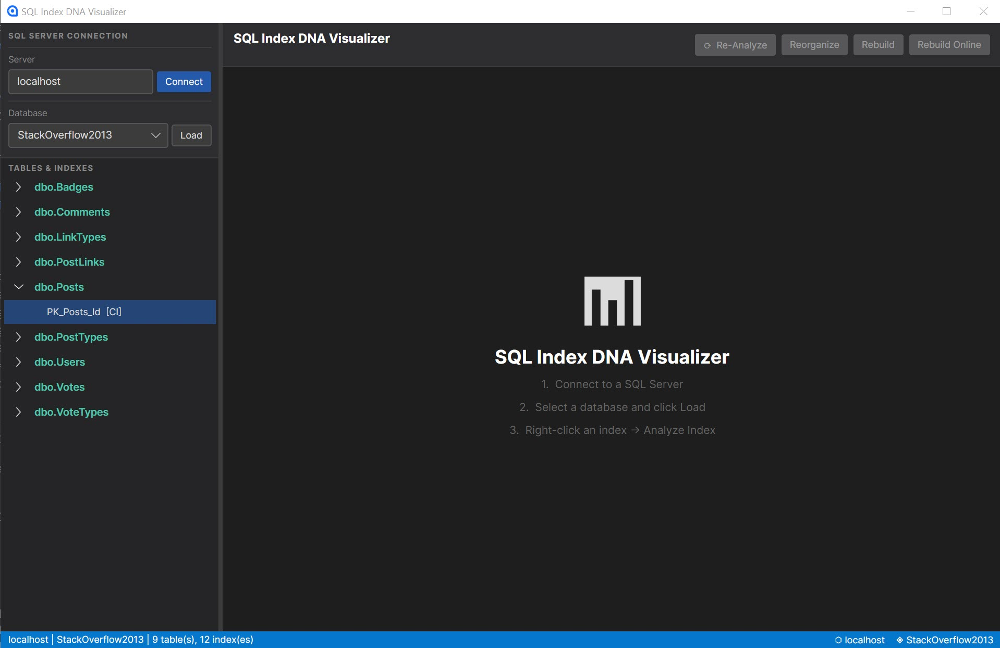

# SQL Index DNA Visualizer

A dark-mode Windows desktop app for visualising SQL Server index page density — built on [Avalonia](https://avaloniaui.net/) and [ScottPlot](https://scottplot.net/), powered by Jeff Moden's `sp_IndexDNA` stored procedure.

## What it does

The app lets you connect to any SQL Server, pick a database, and right-click any index to run `sp_IndexDNA`. It samples every Nth page of the index and plots **page density** (how full each 8 KB page is) against **logical page order**. The result is a signature — the "DNA" — of that index's physical state.



### Why this matters

> *"Lay waste to what people are currently calling best-practice index maintenance."*

Common wisdom says random GUIDs as primary keys cause catastrophic fragmentation. This tool lets you actually see what happens:

- **Random GUIDs** insert uniformly across the whole index, keeping pages consistently dense. Traditional fragmentation metrics mislead you.  
- **Sequential GUIDs (`NEWSEQUENTIALID`)** are probably not the answer you're looking for.  
- **Reorganize** generates orders-of-magnitude more transaction log usage than Rebuild — and you can watch the density chart before and after to compare.

The scatter plot shows the real shape of your index. The rolling average line reveals trends. The fill-factor reference line tells you whether maintenance is even needed.

## Prerequisites

| Requirement | Notes |
|---|---|
| .NET 10 SDK | [Download](https://dotnet.microsoft.com/download/dotnet/10.0) |
| Windows | WinExe target; Avalonia Desktop |
| SQL Server 2008+ | Windows auth (Trusted Connection) |
| `sp_IndexDNA` in `master` | See *Installing sp_IndexDNA* below |

## Build & run

```powershell
git clone https://github.com/ronaldgithub/SQLIndexVisualizer.git
cd SQLIndexVisualizer
dotnet run --project SQLIndexVisualizer/SQLIndexVisualizer.csproj
```

Or open `SQLIndexVisualizer.slnx` in Visual Studio 2022 (17.12+) or Rider and hit Run.

## Installing sp_IndexDNA

`sp_IndexDNA` was written by Jeff Moden. You need it installed in `master` and marked as a system procedure so it can be called from any database context.

```sql
USE [master];
GO
-- paste the contents of examples/sp_IndexDNA (Rev 06).sql here
GO
EXEC sp_ms_marksystemobject 'sp_IndexDNA';
GO
```

The proc requires `sysadmin` or `CONTROL SERVER` permission because it internally calls `DBCC PAGE`.

## Usage

1. **Connect** — enter your server name (default: `localhost`) and click **Connect**.
2. **Load** — select a database from the dropdown and click **Load** to populate the index tree.
3. **Analyse** — right-click any index in the tree and choose **Analyze Index**. The proc samples the index pages and plots density. Large indexes can take several minutes.
4. **Maintain** — use the **Reorganize**, **Rebuild**, or **Rebuild Online** buttons to run maintenance, then re-analyze to compare before/after density.

## Chart legend

| Series | Colour | Meaning |
|---|---|---|
| Scatter points | Blue | Raw page density per sampled page |
| Rolling average | Orange | Sliding-window smoothed density |
| Avg line (dashed) | Teal | Mean density across all sampled pages |
| Fill factor (dotted) | Yellow | Configured fill factor for this index |

## Examples

The `examples/` folder contains:

| File | Purpose |
|---|---|
| `sp_IndexDNA (Rev 06).sql` | The stored procedure itself |
| `IndexDNA for StackOverflow Posts table.sql` | Demo analysis script for the Posts table |
| `badGUID.sql` | Creates a table using `NEWID()` GUIDs to illustrate density behaviour |
| `goodINT.sql` | Same table using an identity INT column for comparison |
| `IndexDNA (Rev 06).xlsx` | Excel workbook with sample output and charts |
| `Empty_IndexDNA (Rev 06).xlsx` | Blank template workbook |

## Stack

- [Avalonia 12](https://avaloniaui.net/) — cross-platform XAML UI framework
- [ScottPlot 5](https://scottplot.net/) — high-performance scatter plotting
- [Microsoft.Data.SqlClient 5](https://github.com/dotnet/SqlClient) — SQL Server connectivity
- [CommunityToolkit.Mvvm 8](https://github.com/CommunityToolkit/dotnet) — MVVM source generators

## License

MIT
